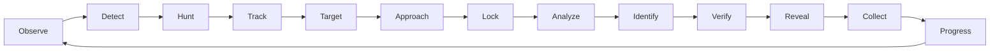

# APEX Vision Scanner Architecture Specification
**Document ID:** `APEX-ARCH-SCAN-01`  
**Revision:** `3.0.0-PROD`  
**Target Environment:** Android (Capacitor 8 / Native CameraX / WebView WebGL) & Progressive Web App

---

## 1. Executive Summary & Vision

APEX is not "another AI car scanner". Traditional car scanning applications follow a rigid, disjointed loop:
$$\text{Camera Frame} \longrightarrow \text{Static Photo} \longrightarrow \text{Server Upload} \longrightarrow \text{Generic Box} \longrightarrow \text{Dismiss}$$

In APEX, the camera is the **game board**, the city is the **map**, and the cars are the **living collectibles**. The interaction paradigm follows an active real-world hunting lifecycle:



The user feels the visceral sensation of tracking and claiming physical automotive engineering in the real world.

---

## 2. Core Subsystems & Layered Architecture

The APEX Scanner is structured into six strictly decoupled subsystems:

```
┌─────────────────────────────────────────────────────────────────────────┐
│                      APEX SCANNER ARCHITECTURE                          │
├─────────────────────────────────────────────────────────────────────────┤
│ 1. CAMERA HARDWARE & STREAMING LAYER                                    │
│    • Hardware Camera (Capacitor Camera / CameraX / WebRTC MediaStream)  │
│    • 1080p60 Realtime Frame Buffer with 0-Copy GPU Memory Pipeline      │
│    • Hardware Auto-Exposure, Continuous AF & Gyro Stabilization         │
├─────────────────────────────────────────────────────────────────────────┤
│ 2. ON-DEVICE EDGE VISION & SCENE MODEL ENGINE                           │
│    • Canvas / WebGL Multi-Vehicle Scene Segmentation & Bounding         │
│    • Real-time Feature Keypoint Tracking & Centroid Estimation          │
│    • Multi-Target Memory & Identity Persistence (Target #01, #02, #03)   │
│    • Spatial Occlusion, Motion Saliency & Lighting Estimator            │
├─────────────────────────────────────────────────────────────────────────┤
│ 3. HUNTER MODE ENGINE & APPROACH GUIDANCE SYSTEM                       │
│    • Target Ranking & Recommendation Matrix                             │
│    • Contextual Dynamic Approach Guidance (Lighting/Angle/Distance)     │
│    • Frequency Resonance Lock Detection & Transition Trigger            │
├─────────────────────────────────────────────────────────────────────────┤
│ 4. PROGRESSIVE VERIFICATION & TEMPORAL INFERENCE ENGINE                 │
│    • Real Pipeline Stage Verification (Visual -> Make -> Model -> Rarity)│
│    • Temporal Feature Consistency Accumulator (>3 Frames Validation)   │
│    • Serverless Proxy Endpoint (/api/analyze) with Signed Token Auth    │
├─────────────────────────────────────────────────────────────────────────┤
│ 5. REVEAL & 3D COLLECTIBLE CARD INTERACTION ENGINE                      │
│    • Progressive Silhouette & Wordmark Assembly                         │
│    • Dynamic 3D Gyro/Touch Tilt Parallax & Light Sweep Card Renderer    │
│    • Collection Number & Authenticity Seal (#APX-XXXXXX)                │
├─────────────────────────────────────────────────────────────────────────┤
│ 6. SERVER-AUTHORITATIVE REWARD & ANTI-CHEAT PIPELINE                    │
│    • Signed Request Digest & Replay Prevention                          │
│    • RLS-Protected Supabase DB & Server-Calculated Regional Rarity      │
│    • Atomic XP, Badge, Mission & Leaderboard Progression Update         │
└─────────────────────────────────────────────────────────────────────────┘
```

---

## 3. First-Launch Camera & Progressive Disclosure

### 3.1 Design Principle: The UI Breathes
When the scanner opens:
1. **Zero Dashboard Clutter:** No intrusive top headers, no giant buttons blocking the camera feed.
2. **Minimal Initial HUD:**
   - Subtle top accent: `APEX // HUNTER MODE` (subdued 10px tracking).
   - Clean center reticle: Ultra-fine geometric aperture.
   - Ambient scan indicator: `SEARCHING SCENE...`
3. **Progressive Triggering:**
   - **0 Cars in view:** Pure camera feed with gentle radar sweeps.
   - **1-3 Cars in view:** Refined diamond geometric anchors (`◇ #01`, `◇ #02`) appear anchored to vehicle centroids.
   - **User taps target / Hunter Mode locks:** Environmental vignette dims background by 35%, reticle snaps to vehicle geometry, and target intelligence HUD activates.

---

## 4. Multi-Vehicle Scene Model & Target Memory

The scene model detects multiple vehicle candidates in the camera frame simultaneously without forcing the player into a single target.

```
       [SCENE FRAME]
        ┌─────────────────────────────────────────────────────────┐
        │                                                         │
        │      CAR #01 (Ferrari 488)      CAR #02 (BMW M3)        │
        │           ◇ #01                      ◇ #02              │
        │       [CONF: 94%]                [CONF: 88%]            │
        │                                                         │
        │                     CAR #03 (Porsche 911)               │
        │                           ◇ #03                         │
        │                       [RECOMMENDED]                     │
        │                                                         │
        └─────────────────────────────────────────────────────────┘
```

### 4.1 Target Memory Protocol
When a car temporarily exits the frame (e.g. user pans slightly or an obstacle passes):
- `TARGET #01` (Tracking active, Centroid $[x_1, y_1]$)
- Vehicle leaves frame $\rightarrow$ `TARGET #01 LOST` (Held in 5-second spatial buffer)
- Vehicle returns $\rightarrow$ `TARGET #01 REACQUIRED` (Maintains continuous ID without resetting target index).

---

## 5. Performance & Threading Constraints
* **UI Thread:** Main thread runs strictly at **60fps / 120fps** using CSS hardware transforms (`translate3d`, `scale`) and WebGL shaders.
* **Inference Pipeline:** Image downsampling and frame analysis execute asynchronously in background Web Workers or via async serverless streaming to prevent frame drops.
* **Network Throttling:** Debounced frame submission ensures low bandwidth utilization (<120KB per verified scan).
