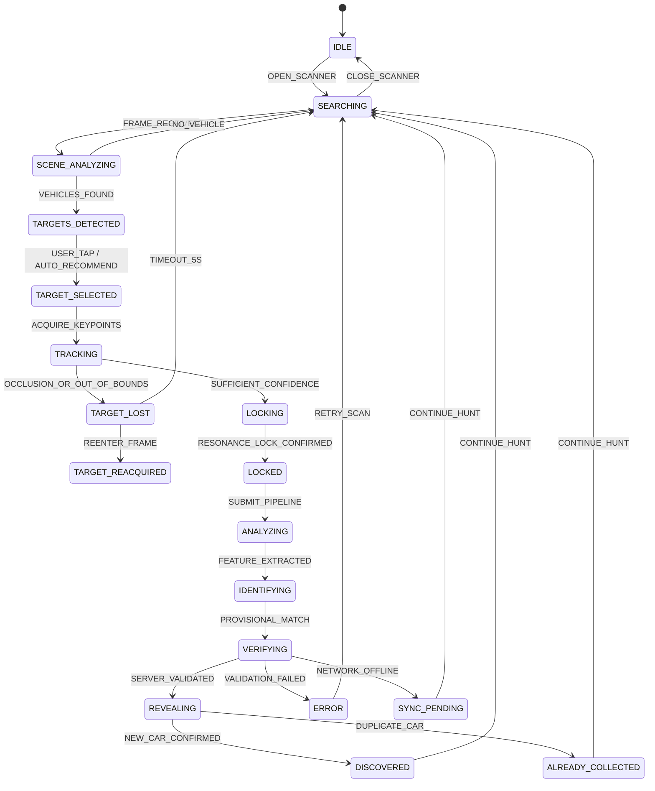

# APEX Scanner State Machine Specification
**Document ID:** `APEX-SPEC-STATE-03`  
**Revision:** `3.0.0-PROD`

---

## 1. State Machine Definition

The APEX Scanner avoids ad-hoc boolean flags by operating on an explicit, strictly typed deterministic Finite State Machine (FSM).

---

## 2. Complete State Enumeration & Behavioral Rules

| State Enum | UI Presentation | Allowed Transitions | Audio & Haptic Feedback |
|---|---|---|---|
| `IDLE` | Scanner closed / background standby | `SEARCHING` | None |
| `SEARCHING` | Clean camera, minimal radar sweep, 10px tracking label | `SCENE_ANALYZING`, `IDLE` | Ambient low-pass hum |
| `SCENE_ANALYZING` | Dynamic edge-detection evaluation | `TARGETS_DETECTED`, `SEARCHING` | Subtle scan ping |
| `TARGETS_DETECTED` | Subtle geometric diamonds (`◇ #01`, `◇ #02`) anchored to centroids | `TARGET_SELECTED`, `SEARCHING` | Light blip on appearance |
| `TARGET_SELECTED` | Selected diamond enlarges, unselected dim to 30% | `TRACKING`, `SEARCHING` | Soft haptic tap |
| `TRACKING` | Reticle follows vehicle bounding centroid across frames | `TARGET_LOST`, `LOCKING` | Continuous micro-tracking pulse |
| `TARGET_LOST` | Diamond turns dashed yellow, label displays `TARGET #01 LOST` | `TARGET_REACQUIRED`, `SEARCHING` | Low warning tick |
| `TARGET_REACQUIRED` | Diamond snaps solid orange: `TARGET #01 REACQUIRED` | `TRACKING`, `LOCKING` | Sharp recovery blip |
| `LOCKING` | Reticle geometry contracts, environment dims by 35% | `LOCKED`, `TRACKING` | Ascending frequency glide (400Hz $\rightarrow$ 880Hz) |
| `LOCKED` | **Signature Target Lock:** Solid orange box locks vehicle contour | `ANALYZING` | Resonant mechanical lock sound + Heavy haptic |
| `ANALYZING` | Real-time stage 1: Visual feature extraction | `IDENTIFYING`, `ERROR` | Data processing clicks |
| `IDENTIFYING` | Real-time stage 2: Make & model recognition resolution | `VERIFYING`, `ERROR` | Confirmation tone |
| `VERIFYING` | Real-time stage 3: Supabase database & regional rarity verify | `REVEALING`, `SYNC_PENDING`, `ERROR` | Uplink chime |
| `REVEALING` | Progressive assembly: Make emblem $\rightarrow$ Silhouette $\rightarrow$ Model name | `DISCOVERED`, `ALREADY_COLLECTED` | Epic orchestral / synthesis swell |
| `DISCOVERED` | 3D Interactive Collectible Card emerges with specular sweep | `SEARCHING`, `IDLE` | Victory chord + Tier-specific fanfare + Confetti |
| `ALREADY_COLLECTED` | Collectible Card displays `REPEAT SPOT (+50 XP)` | `SEARCHING`, `IDLE` | Moderate confirmation chime |
| `SYNC_PENDING` | Card stamped `CACHED OFFLINE // PENDING UPLINK` | `SEARCHING`, `IDLE` | Neutral chime |
| `ERROR` | Non-blocking guidance banner (e.g. `"Need clearer view"`) | `SEARCHING` | Muted warning tone |

---

## 3. Transition Determinism & Invariants
1. **Zero Boolean Inconsistency:** All scanner UI components query `state.phase: ScannerState` exclusively.
2. **No Fake Progressions:** The FSM only transitions `ANALYZING` $\rightarrow$ `IDENTIFYING` $\rightarrow$ `VERIFYING` $\rightarrow$ `REVEALING` when real async pipeline stages complete.
3. **Auto-Recovery:** Any transient failure in `TARGET_LOST` automatically falls back to `SEARCHING` after 5,000ms without leaving the player stuck.
