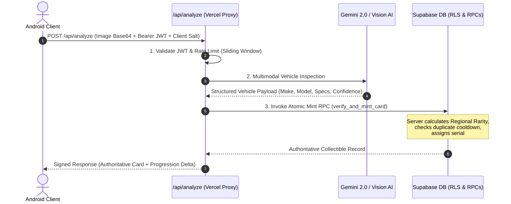

# APEX Security & Anti-Cheat Model
**Document ID:** `APEX-SPEC-SEC-05`  
**Revision:** `3.0.0-PROD`

---

## 1. Threat Model & Zero-Trust Client Axiom

**Core Axiom:** *The Android client device is assumed to be fully compromised by a hostile actor who can decompile the APK, alter client-side state, intercept network calls, automate requests, and forge parameters.*

Under this zero-trust model, the server **NEVER** trusts client-supplied:
* Car ID, model, or make.
* Rarity tier or rarity score.
* XP rewards, coin rewards, or level updates.
* Discovery timestamps or GPS coordinates.
* Leaderboard rankings or hunt completion claims.

---

## 2. Server-Authoritative Scan Verification Pipeline

---

## 3. Anti-Cheat & Exploit Protections

| Threat Vector | Attack Mechanism | APEX Defensive Mitigation |
|---|---|---|
| **Replay Attack** | Resubmitting the same photo or payload repeatedly | Server enforces image perceptual hash (`pHash`) deduplication with a 24-hour duplicate cooldown per GPS grid. |
| **Rarity Tampering** | Client injecting `"rarity": "mythic"` | Rarity is computed exclusively on the server in `verify_and_mint_card` RPC based on regional scarcity database tables. |
| **API Flooding / DoS** | Bot hammering `/api/analyze` | IP + User ID sliding-window rate limiting (Max 20 requests per 5 minutes) with HTTP 429 backoff. |
| **Arbitrary ID Injection** | Calling DB insert with forged card ID | Direct table writes blocked via Supabase Row Level Security; writes restricted to SECURITY DEFINER stored procedures. |
| **GPS Spoofing** | Teleporting across cities instantly | Server enforces velocity checks ($\Delta \text{distance} / \Delta t < 900\text{ km/h}$). |
| **Automated Emulator Farming** | Headless scripts emulating camera feed | High-value and competitive discoveries challenge Google Play Integrity Standard API tokens before reward commit. |
