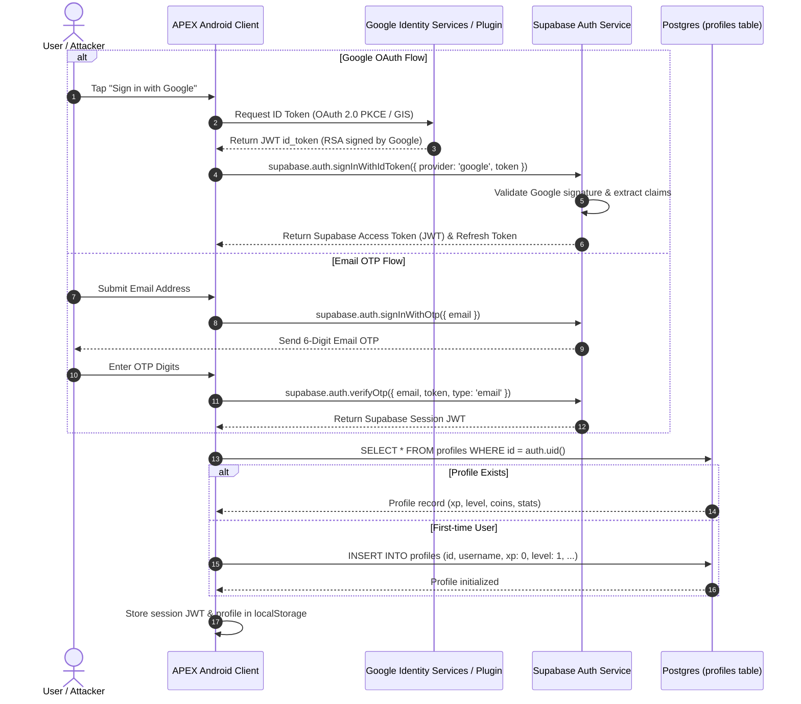
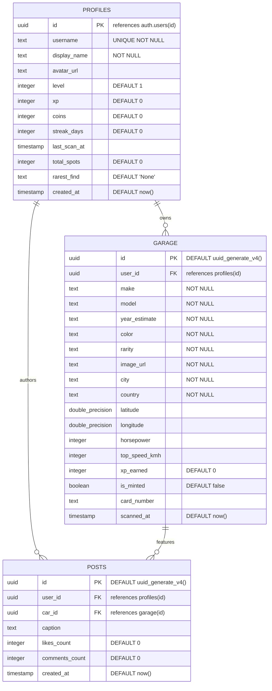

# APEX — Production Security Architecture Review
**Target System:** APEX Android Application (`org.juliankaiser.apex`) & Backend Ecosystem  
**Classification:** Defensive Security Architecture & Reconnaissance  
**Standard Alignment:** OWASP MASVS v2.0, OWASP MASTG, Google Play Integrity & Platform Security Guidelines  

---

## 1. Executive Summary & Security Baseline

APEX is a hybrid Android application combining high-performance mobile UI (React 19 + TypeScript + TailwindCSS bundled via Capacitor 8.5.0) with real-world computer vision, geolocation, and gamified digital collectibles (car cards, regional rarity tiers, XP, quests, leaderboards).

### Core Security Model Assumption
> **Zero Trust on Client Execution:** The Android client is assumed to be running in an adversarial environment. An attacker can decompile APK assets, extract strings and API keys, hook JavaScript/Java runtimes (Frida/Xposed), spoof GPS coordinates, bypass client-side validation logic, and invoke Supabase PostgREST endpoints directly using user session JWTs.

---

## 2. System Architecture Map

```
┌─────────────────────────────────────────────────────────────────────────────────────────┐
│                                ADVERSARIAL ANDROID RUNTIME                              │
│                                                                                         │
│  ┌───────────────────────────────────────────────────────────────────────────────────┐  │
│  │ MainActivity (BridgeActivity) — org.juliankaiser.apex                             │  │
│  │                                                                                   │  │
│  │   ┌────────────────────────────────────────────────────────────────────────────┐  │  │
│  │   │ Chromium WebView (React 19 SPA)                                            │  │  │
│  │   │                                                                            │  │  │
│  │   │  • UI HUD / Components (Scanner, Garage, Map, Social, Onboarding)          │  │  │
│  │   │  • Zustand State Store (useApexStore)                                      │  │  │
│  │   │  • Client-Side Engines: Regional Rarity, XP Engine, EXIF Validator         │  │  │
│  │   │  • LocalStorage (Tokens, User Profile, Session State)                      │  │  │
│  │   └────────────────────────────────────────────────────────────────────────────┘  │  │
│  │                                                                                   │  │
│  │   ┌─────────────────────────── Capacitor Plugins ──────────────────────────────┐  │  │
│  │   │ Camera (@capacitor/camera)             Geolocation (@capacitor/geolocation)│  │  │
│  │   │ PushNotifications (@capacitor/push)    GoogleSignIn (@capawesome/google)   │  │  │
│  │   └────────────────────────────────────────────────────────────────────────────┘  │  │
│  └───────────────────────────────────────────────────────────────────────────────────┘  │
└─────────────────────────────────────────┬───────────────────────────────────────────────┘
                                          │
                  ┌───────────────────────┼────────────────────────┐
                  │ (HTTPS / TLS 1.3)     │ (HTTPS / TLS 1.3)      │ (HTTPS / TLS 1.3)
                  ▼                       ▼                        ▼
      ┌───────────────────────┐ ┌───────────────────┐ ┌──────────────────────────┐
      │   SUPABASE BACKEND    │ │ VERCEL SERVERLESS │ │  THIRD-PARTY EXTERNAL    │
      │                       │ │                   │ │                          │
      │ • Supabase Auth       │ │ • /api/analyze    │ │ • Google Gemini API      │
      │   (PKCE, GIS, OTP)    │ │   (Vision Proxy)  │ │   (Direct Client SDK)    │
      │ • PostgreSQL Database │ │ • OpenAI gpt-4o   │ │ • OSM Nominatim          │
      │ • Row Level Security  │ │ • Gemini 2.5      │ │   (Reverse Geocoding)    │
      │ • Storage Buckets     │ │                   │ │ • CartoDB Dark Tiles     │
      └───────────────────────┘ └───────────────────┘ └──────────────────────────┘
```

---

## 3. Authentication Flow Architecture



### Authentication Architecture Weaknesses
1. **Fallback Mock Account Trap:** In `src/services/googleAuthService.ts`, if offline or Client ID fails, the app generates a hardcoded demo user (`google-user-${Date.now()}`) and logs the user into client state.
2. **Client-Driven User Profile Creation:** Profile initialization and fallback usernames are executed directly by client-side `INSERT` into the `profiles` table instead of an atomic server-side PostgreSQL trigger on `auth.users.created`.

---

## 4. Authorization Flow & Permission Model

```mermaid
graph TD
    Client[Adversarial Android Client] -->|JWT in Authorization Header| PostgREST[Supabase PostgREST Gateway]
    PostgREST -->|Evaluate RLS Policy| PostgreSQL[(PostgreSQL Database)]
    
    subgraph Row Level Security (RLS) Evaluation
        Policy1["profiles: auth.uid() = id (SELECT/INSERT/UPDATE)"]
        Policy2["garage: auth.uid() = user_id (SELECT/INSERT/UPDATE)"]
        Policy3["posts: auth.uid() = user_id (SELECT/INSERT)"]
    end
```

### Authorization Vulnerability Pattern
* **Current Policy Formulation:** RLS enforces **Row Identity (`auth.uid() = user_id`)** but lacks **Column & Business Logic Validation**.
* **Impact:** A logged-in attacker with a valid JWT can perform direct HTTP `PATCH` or `INSERT` requests against PostgREST:
  ```http
  PATCH /rest/v1/profiles?id=eq.<attacker-uuid> HTTP/1.1
  Host: nxrtnexhyieiszgglhbn.supabase.co
  Authorization: Bearer <attacker-jwt>
  Content-Type: application/json

  {"xp": 999999, "level": 50, "coins": 50000, "total_spots": 1000}
  ```
  PostgreSQL evaluates `auth.uid() = id` as `TRUE` and updates the values without server-side validation.

---

## 5. Complete API Map

| Endpoint / Target | Protocol / Method | Auth Required | Provider / Handler | Purpose | Security Controls |
|---|---|---|---|---|---|
| `https://nxrtnexhyieiszgglhbn.supabase.co/auth/v1/*` | HTTPS POST | Public / PKCE | Supabase Auth | Sign-in with ID Token, OTP dispatch & verification | Rate limited by Supabase, PKCE flow |
| `https://nxrtnexhyieiszgglhbn.supabase.co/rest/v1/profiles` | HTTPS CRUD | Bearer JWT | PostgREST / PostgreSQL | Read/Update user profile stats | RLS enabled (`auth.uid() = id`), **no column validation** |
| `https://nxrtnexhyieiszgglhbn.supabase.co/rest/v1/garage` | HTTPS CRUD | Bearer JWT | PostgREST / PostgreSQL | Insert/View scanned collectible cards | RLS enabled (`auth.uid() = user_id`), **no rarity validation** |
| `https://nxrtnexhyieiszgglhbn.supabase.co/rest/v1/posts` | HTTPS CRUD | Bearer JWT | PostgREST / PostgreSQL | Social feed creation & viewing | RLS enabled (`auth.uid() = user_id`) |
| `/api/analyze` | HTTPS POST | **None (Public)** | Vercel Serverless Function | Server-side AI image analysis proxy | Body limit 4MB; **Missing Auth, CSRF, Rate Limiting** |
| `https://generativelanguage.googleapis.com/v1beta/*` | HTTPS POST | Client API Key | Google Cloud Gemini | Direct client-to-cloud Gemini AI vision analysis | **Client-embedded key (`VITE_GEMINI_API_KEY`)** |
| `https://nominatim.openstreetmap.org/reverse` | HTTPS GET | **None (Public)** | OpenStreetMap Nominatim | Reverse geocode lat/lng to city name | **No API key, unthrottled, no custom User-Agent** |
| `https://{s}.basemaps.cartocdn.com/dark_all/*` | HTTPS GET | **None (Public)** | CartoDB CDN | Dark raster map tile fetching | Public tile service |

---

## 6. Database / Schema Map



---

## 7. Third-Party SDK & Dependency Inventory

| SDK / Package | Version | Layer / Environment | Stated Purpose | Security Risk Profile |
|---|---|---|---|---|
| `@capacitor/core` | `^8.5.0` | Native Android Bridge | Web-to-native JavaScript interface bridge | Bridge exposure, JS-to-Java IPC |
| `@capacitor/android` | `^8.5.0` | Native Android Runtime | Android native application shell | WebView configuration, intent handling |
| `@capacitor/camera` | `^8.2.2` | Native Plugin | Capturing vehicle photos | File system permissions, temporary storage leakage |
| `@capacitor/geolocation` | `^8.2.0` | Native Plugin | Device GPS coordinates | Location privacy, GPS spoofing sensitivity |
| `@capacitor/push-notifications` | `^8.1.2` | Native Plugin | Remote FCM push notification token registration | Token handling, notification payload parsing |
| `@capawesome/capacitor-google-sign-in` | `^0.1.2` | Native Plugin | Google OAuth authentication | Token validation, intent redirection |
| `@google/genai` | `^2.15.0` | Client JavaScript | Direct Google Gemini AI SDK | **Exposes Gemini API credentials in client bundle** |
| `@supabase/supabase-js` | `^2.112.0` | Client JavaScript | Supabase Auth & PostgREST Database Client | Subject to client manipulation if RLS incomplete |
| `leaflet` / `react-leaflet` | `^1.9.4` / `^5.0.0` | Client UI | Dark map rendering & spot markers | DOM XSS via unescaped marker popups |
| `canvas-confetti` | `^1.9.4` | Client UI | Visual celebration effects | Low risk (DOM canvas only) |
| `html2canvas` | `^1.4.1` | Client Utility | Card image rendering/export | DOM parsing risks |

---

## 8. Secrets & Credential Inventory

| Secret Identifier | Location Identified | Target Service | Exposure Level | Exploitation Impact |
|---|---|---|---|---|
| `VITE_GEMINI_API_KEY` | `src/services/aiVisionService.ts`, `.env` | Google Generative AI | **CRITICAL: Embedded in client bundle** | Quota theft, unauthorized LLM queries, billing abuse |
| `VITE_SUPABASE_ANON_KEY` | `src/lib/supabase.ts`, `.env` | Supabase PostgREST | **MEDIUM: Public client token** | Expected public, but permits unauthenticated API abuse if RLS flawed |
| `VITE_GOOGLE_CLIENT_ID` | `capacitor.config.ts`, `src/services/googleAuthService.ts` | Google Cloud OAuth | **INFO: Public OAuth Client ID** | Normal OAuth public identifier |
| `OPENAI_API_KEY` | `api/analyze.ts` (process.env) | OpenAI API | **SERVER-SIDE: Vercel Environment** | Secure if restricted to serverless runtime |
| `GEMINI_API_KEY` | `api/analyze.ts` (process.env) | Google Cloud API | **SERVER-SIDE: Vercel Environment** | Secure if restricted to serverless runtime |

---

## 9. Android Manifest & Component Inventory

| Component / Directive | Attribute / Value | Stated Purpose | Security Evaluation |
|---|---|---|---|
| `package` / `namespace` | `org.juliankaiser.apex` | Application identifier | Standard |
| `application:allowBackup` | `false` | Disables ADB and cloud backup | **PASSED:** Prevents local sandbox extraction via `adb backup` |
| `MainActivity` | `android:exported="true"`, `launchMode="singleTask"` | Main launcher activity | **PASSED:** Required for launcher; handles single task instance |
| `FileProvider` | `android:name="androidx.core.content.FileProvider"`, `android:exported="false"`, `grantUriPermissions="true"` | File sharing between camera & app | **PASSED:** Not exported, restricted URI grants |
| `android:networkSecurityConfig` | *Not Specified* | Network security policy & pinning | **FAILED:** Missing explicit cleartext disallowance and trust anchors |
| Permissions: `CAMERA` | `<uses-permission android:name="android.permission.CAMERA" />` | Hardware camera capture | Standard dangerous permission, runtime prompt required |
| Permissions: `FINE_LOCATION` | `<uses-permission android:name="android.permission.ACCESS_FINE_LOCATION" />` | High-accuracy GPS | Standard dangerous permission, runtime prompt required |
| Permissions: `INTERNET` | `<uses-permission android:name="android.permission.INTERNET" />` | Network access | Standard normal permission |

---

## 10. Build & Release Configuration Inventory

| Setting | Current Value | Target Standard | Security Gap Analysis |
|---|---|---|---|
| `android.buildTypes.release.minifyEnabled` | `false` | `true` | **HIGH RISK:** Code minification, dead code elimination, and R8 obfuscation are disabled in release APKs. Decompilation yields readable class/method names and JS assets. |
| `android.buildTypes.release.proguardFiles` | `proguard-rules.pro` (Inactive) | Active Proguard/R8 | Rules are not executed because `minifyEnabled` is false. |
| Play Integrity API Integration | None | Hardware-backed App Attestation | No server-side verification that requests originate from an untampered binary on a genuine Google-certified Android device. |
| APK Signing Config | Debug/Unconfigured in build script | Play App Signing / Release Keystore | Automated release signing must enforce v2/v3 APK signature scheme. |
| Asset Packaging | `dist/assets` copied to APK `assets/public` | Obfuscated/Bundled | JS bundle contains intact string literals, endpoints, and schema definitions. |

---

## 11. Local Storage & Sensitive Data Inventory

| Storage Mechanism | Data Stored | Path / Scope | Encryption at Rest | Risk Level |
|---|---|---|---|---|
| Web Storage (`localStorage`) | `apex_user_session` (User Profile, Google Data) | Webview sandbox leveldb | **None (Plaintext)** | **MEDIUM:** Readable via physical extraction on rooted device |
| Web Storage (`localStorage`) | `sb-*-auth-token` (Supabase JWT & Refresh Token) | Webview sandbox leveldb | **None (Plaintext)** | **MEDIUM:** Long-lived refresh token stored unencrypted |
| Web Storage (`localStorage`) | `apex_garage_cards` (Offline card cache) | Webview sandbox leveldb | **None (Plaintext)** | **LOW:** Non-sensitive user collection data |
| Android Sandbox Files | Camera temporary image capture files | `cacheDir` / `externalCacheDir` | **None** | **LOW:** Temporary capture buffers |

---

## 12. Upload & File Processing Pipeline Inventory

| Pipeline Stage | Implementation | Execution Location | Security Controls & Flaws |
|---|---|---|---|
| **Capture & Compression** | HTML5 Canvas / Capacitor Camera | Client Memory | Max 4MB size constraint; Image converted to Base64 in RAM |
| **EXIF Pre-Validation** | `validateExifData()` in `authenticityPipeline.ts` | **Client (JS)** | Checks timestamp (<180s), software tags, resolution. **Client-side only — attacker can bypass via script**. |
| **AI Authenticity Check** | `runAiAuthenticityCheck()` | **Client Stub** | Hardcoded stub returning `passed: true`. **Zero real server validation**. |
| **Car Classification** | `identifyVehicleWithAi()` / `/api/analyze` | Client or Vercel Proxy | Gemini / GPT-4o analyzes vehicle features. **Results returned to client and trusted implicitly**. |
| **Database Insertion** | `addCardToGarage()` in `useApexStore.ts` | **Client (PostgREST)** | Client constructs the `CarCard` payload (make, model, rarity, XP) and sends direct INSERT to database. |

---

## 13. Security-Sensitive Business Logic Inventory

| Business Logic | Implemented In | Execution Environment | Authority Trust Failure |
|---|---|---|---|
| **Rarity Tier Assignment** | `regionalRarityEngine.ts` | **Client-side JS** | Client assigns rarity tier ('mythic', 'legendary') based on local formula. Attacker can override rarity in request payload. |
| **XP Gain Calculation** | `calculateScanXp()` in `rarity.ts` | **Client-side JS** | Client calculates XP based on rarity and bonus multipliers and writes directly to `profiles.xp`. |
| **Level Progression** | `getLevelFromXp()` in `rarity.ts` | **Client-side JS** | Level is derived on client and written directly to database without server formula enforcement. |
| **Daily Quests & Missions** | `useApexStore.ts` | **Client-side JS** | Client checks if scanned car matches quest requirements and sets `isCompleted: true`, awarding coins/XP locally. |
| **GPS Coordinate Blur** | `applySpatialOffset()` in `privacyPipeline.ts` | **Client-side JS** | Privacy offset is applied on client before database insertion; client can choose whether or not to store real GPS. |

---

## 14. Trust Boundaries

```
[Adversarial Android Device]
  ║
  ╠══ [TB-1: Client-to-Supabase Boundary] ═════════════════════════════════════════╗
  ║   Threat: Client sends falsified XP, mythic cars, fake quest completions.      ║
  ║   Flaw: PostgreSQL RLS trusts client-submitted column values.                  ║
  ║                                                                                ║
  ╠══ [TB-2: Client-to-Vercel API Boundary] ═══════════════════════════════════════╣
  ║   Threat: Anonymous bot floods /api/analyze with garbage images.               ║
  ║   Flaw: No rate-limiting, no API authentication, no user session validation.   ║
  ║                                                                                ║
  ╠══ [TB-3: Client-to-Gemini API Boundary] ═══════════════════════════════════════╣
  ║   Threat: Attacker extracts API key from bundle and drains account quota.      ║
  ║   Flaw: Direct client API call using VITE_GEMINI_API_KEY.                      ║
  ║                                                                                ║
  ╠══ [TB-4: Client-to-Nominatim Boundary] ════════════════════════════════════════╣
  ║   Threat: IP block by OpenStreetMap for violating User-Agent / rate policy.   ║
  ║   Flaw: Direct fetch() without proxy or compliance headers.                    ║
  ╚════════════════════════════════════════════════════════════════════════════════╝
```
